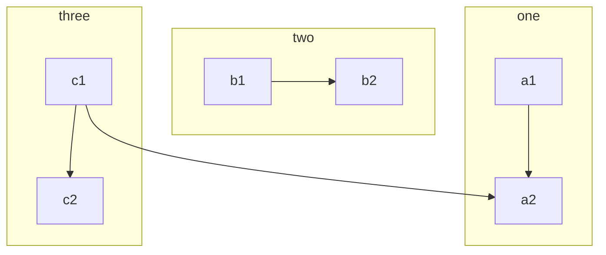
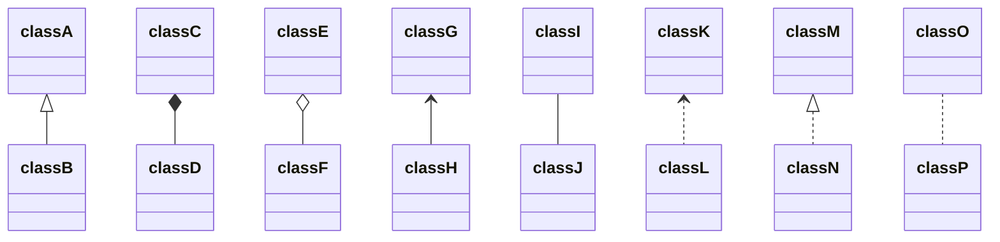
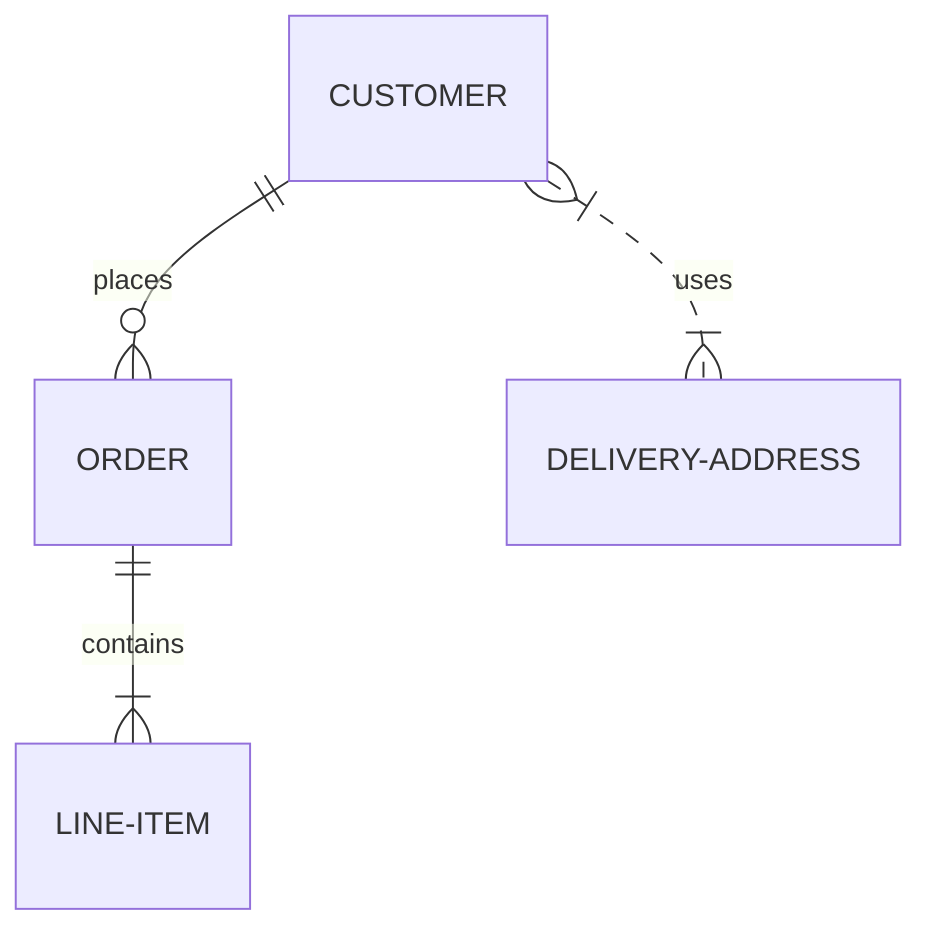

# RESOURCES

## LINUX BASICS
   
**X WINDOW SYSTEM**
   - XFree86 was the de facto X Server till 2004 after which a fork of it is maintained by non-profit X.Org foundation which is the predominant implementation now.
   - Key components of a X Window System:
     - _Display Manager (DM)_: Job is to authenticate users, log them in and startup initial environment using startup scripts. The DM also start the X Server.
     - _X Server_: defines an abstract interface to the system's bitmapped displays and input devices. It understands only basic drawing primitives over a network API which allows it to run on computers which are seprate from the client and, support variety of window managers and widgets.
     - _Window Manager_: which allows users to move, resize, minimize and maximize windows and allows use virtual desktops as well.
   - **Display Manger** presents the user with a graphical login screen which is not necessary and some users prefer to start X from the console or from their **.login** script by running **startx** which is a wrapper for **xinit** that starts the X server. **xdm** (X display manager) is the original DM but **gmd** (GNOME) and **kdm** (KDE) are the most popular ones now. Configuration files for **xdm, gdm** or **kdm** are in **/etc/X11**. The display manager's final duty is to execute **Xsession**, a shell script to setup desktop environment which is often found in **/etc/X11/{xdm,gdm,kdm}**. The **Xsession** also executes the user's personal **~/.xession**. All the commands are run in the background except the _last one_ which is the _Window Manager_. Once you exit the WM the DM logs the user out and the session ends.
  
   - To **run an X application**, clients must be told what display to connect to and what screen to inhabit on that display. Once connected, the clients must **authenticate** themselves to the X server. Note the X's intrinsic security is weak so most of the time it's tunneled securely eg. use SSH for X connection.

   - The X applications consults **DISPLAY** environment variable to find out where to display themselves. For example: ```export DISPLAY=servername.domain.com:10.2``` points X application at the machine `servername.domain.com`, display `10 and, screen `2`. 

   - For **client authentication**, the X display manager generates a large random number, called a _cookie_, early in the login process. The cookie for the server is written to the **~/.Xauthority**. Users can run the `xauth` command to view existing cookies and new ones. For example, if you get an error to open display on the client side ```client$ xprogram -display server:0```, probably the client doesn't have the _auth cookie_. On the server, you can run ```server$ xauth list``` to list all the cookies for each interface (ethernet, local, unix domain). The easiest way to add the cookie to the client is adding the cookie using **xauth** (when not using SSH, which negotiates the cookie autmatically for you): ```client$ xuath add server:0 MIT-MAGIC-COOKIE-1 <cookieFromServer>```.
   - **SSH** can forward arbitrary network data including X protocol data, over a secure channel. Since SSH is X-aware, you gain some additional features, including a pseudo-display on the remote machine and the negotiated transfer of magic cookies. You typically **ssh** from the machine running X-server to the machine running the X programs. This arrangement can be confusing to read about because the SSH _client_ is run on the same machine as the X _server_, and it connects to to an SSH _server_ that is on the same machine as the X _client_applications. To make it worse, the virtual display that SSH creates for your X server is local to the remote system. The _DISPLAY_ variable and authentication information are setup automatically by **ssh**. The display number starts at `:10.0` and increments by one for each SSH connection that is forwarding X traffic. You can see the transaction details during a connection using the verbose option '-v': ```x-server$ ssh -v -X x-client.domain.com```. If things are not working properly, along with the verbose output, check the global setting in **/etc/ssh** to make sure X forwarding has not been disabled.
   - X server **Xorg** configuration was once notoriouly difficult to configure for a given hardware but lot of effort has been put to make Xorg work out of the box. If your system is running without a Xorg configthen great! Most probably it's using the KMS module. The **Xorg** configuration is typically located in **/etc/X11/xorg.conf**.


## MARKDOWN REFERENCE

### Markdown Elements

Text can be **bold**, _italic_, or ~~strikethrough~~. [Links](https://github.com) should be blue with no underlines (unless hovered over).

There should be whitespace between paragraphs. There should be whitespace between paragraphs. There should be whitespace between paragraphs. There should be whitespace between paragraphs.

There should be whitespace between paragraphs. There should be whitespace between paragraphs. There should be whitespace between paragraphs. There should be whitespace between paragraphs.

> There should be no margin above this first sentence.
>
> Blockquotes should be a lighter gray with a gray border along the left side.
>
> There should be no margin below this final sentence.

# Header 1

This is a normal paragraph following a header. Bacon ipsum dolor sit amet t-bone doner shank drumstick, pork belly porchetta chuck sausage brisket ham hock rump pig. Chuck kielbasa leberkas, pork bresaola ham hock filet mignon cow shoulder short ribs biltong.

## Header 2

> This is a blockquote following a header. Bacon ipsum dolor sit amet t-bone doner shank drumstick, pork belly porchetta chuck sausage brisket ham hock rump pig. Chuck kielbasa leberkas, pork bresaola ham hock filet mignon cow shoulder short ribs biltong.

### Header 3

```
This is a code block following a header.
```

#### Header 4

- This is an unordered list following a header.
- This is an unordered list following a header.
- This is an unordered list following a header.

##### Header 5

1. This is an ordered list following a header.
2. This is an ordered list following a header.
3. This is an ordered list following a header.

###### Header 6

| What    | Follows  |
| ------- | -------- |
| A table | A header |
| A table | A header |
| A table | A header |

---

There's a horizontal rule above and below this.

---

Here is an unordered list:

- Salt-n-Pepa
- Bel Biv DeVoe
- Kid 'N Play

And an ordered list:

1. Michael Jackson
2. Michael Bolton
3. Michael Bublé

And an unordered task list:

- [x] Create a sample markdown document
- [x] Add task lists to it
- [ ] Take a vacation

And a "mixed" task list:

- [ ] Steal underpants
- ?
- [ ] Profit!

And a nested list:

- Jackson 5
  - Michael
  - Tito
  - Jackie
  - Marlon
  - Jermaine
- TMNT
  - Leonardo
  - Michelangelo
  - Donatello
  - Raphael

Definition lists can be used with HTML syntax. Definition terms are bold and italic.

<dl>
    <dt>Name</dt>
    <dd>Godzilla</dd>
    <dt>Born</dt>
    <dd>1952</dd>
    <dt>Birthplace</dt>
    <dd>Japan</dd>
    <dt>Color</dt>
    <dd>Green</dd>
</dl>

---

Tables should have bold headings and alternating shaded rows.

| Artist          | Album          | Year |
| --------------- | -------------- | ---- |
| Michael Jackson | Thriller       | 1982 |
| Prince          | Purple Rain    | 1984 |
| Beastie Boys    | License to Ill | 1986 |

If a table is too wide, it should condense down and/or scroll horizontally.

<!-- prettier-ignore-start -->

| Artist            | Album           | Year | Label       | Awards   | Songs     |
|-------------------|-----------------|------|-------------|----------|-----------|
| Michael Jackson   | Thriller        | 1982 | Epic Records | Grammy Award for Album of the Year, American Music Award for Favorite Pop/Rock Album, American Music Award for Favorite Soul/R&B Album, Brit Award for Best Selling Album, Grammy Award for Best Engineered Album, Non-Classical | Wanna Be Startin' Somethin', Baby Be Mine, The Girl Is Mine, Thriller, Beat It, Billie Jean, Human Nature, P.Y.T. (Pretty Young Thing), The Lady in My Life |
| Prince            | Purple Rain     | 1984 | Warner Brothers Records | Grammy Award for Best Score Soundtrack for Visual Media, American Music Award for Favorite Pop/Rock Album, American Music Award for Favorite Soul/R&B Album, Brit Award for Best Soundtrack/Cast Recording, Grammy Award for Best Rock Performance by a Duo or Group with Vocal | Let's Go Crazy, Take Me With U, The Beautiful Ones, Computer Blue, Darling Nikki, When Doves Cry, I Would Die 4 U, Baby I'm a Star, Purple Rain |
| Beastie Boys      | License to Ill  | 1986 | Mercury Records | noawardsbutthistablecelliswide | Rhymin & Stealin, The New Style, She's Crafty, Posse in Effect, Slow Ride, Girls, (You Gotta) Fight for Your Right, No Sleep Till Brooklyn, Paul Revere, Hold It Now, Hit It, Brass Monkey, Slow and Low, Time to Get Ill |

<!-- prettier-ignore-end -->

---

Code snippets like `var foo = "bar";` can be shown inline.

Also, `this should vertically align` ~~`with this`~~ ~~and this~~.

Code can also be shown in a block element.

```
var foo = "bar";
```

Code can also use syntax highlighting.

```javascript
var foo = "bar";
```

```
Long, single-line code blocks should not wrap. They should horizontally scroll if they are too long. This line should be long enough to demonstrate this.
```

```javascript
var foo =
  "The same thing is true for code with syntax highlighting. A single line of code should horizontally scroll if it is really long.";
```

Inline code inside table cells should still be distinguishable.

| Language   | Code               |
| ---------- | ------------------ |
| Javascript | `var foo = "bar";` |
| Ruby       | `foo = "bar"`      |

---

Small images should be shown at their actual size.


Large images should always scale down and fit in the content container.


```
This is the final element on the page and there should be no margin below this.
```

### Avatar Test

```

```



```tip
Set config `plugins: [jekyll-avatar]`

For documentation, see: [https://github.com/benbalter/jekyll-avatar](https://github.com/benbalter/jekyll-avatar)
```

### Code Blocks

`inline code`

[`inline code inside link`](./)

```
:root {
  @for $level from 1 through 12 {
    @if $level % 4 == 0 {
      --toc-#{$level}: #{darken($theme-white, 4 * 8.8%)};
    } @else {
      --toc-#{$level}: #{darken($theme-white, $level % 4 * 8.8%)};
    }
  }
}
```

**Highlight:**

```scss
:root {
  @for $level from 1 through 12 {
    @if $level % 4 == 0 {
      --toc-#{$level}: #{darken($theme-white, 4 * 8.8%)};
    } @else {
      --toc-#{$level}: #{darken($theme-white, $level % 4 * 8.8%)};
    }
  }
}
```

### Emoji Test

```
I give this theme two :+1:!
```

I give this theme two :+1:!

```tip
Set config `plugins: [jemoji]`, Emoji searcher, see: [https://emoji.muan.co/](https://emoji.muan.co/)
```

### Fonts Test

`{:.font-mono}`

```
{{ page.text -}}
```

`{:.font-body}`

{:.font-body}
{{ page.text }}

`{:.font-head}`

{:.font-head}
{{ page.text }}

#### font-awesome

```html
<i class="fa fa-check-circle text-green">checked</i>
<i class="fa fa-battery-quarter text-red">battery</i>
```

<i class="fa fa-check-circle text-green">checked</i>
<i class="fa fa-battery-quarter text-red">battery</i>

### Gist Test

```

```



### Mathjax Test

$$
\begin{aligned}
  & \phi(x,y) = \phi \left(\sum_{i=1}^n x_ie_i, \sum_{j=1}^n y_je_j \right)
  = \sum_{i=1}^n \sum_{j=1}^n x_i y_j \phi(e_i, e_j) = \\
  & (x_1, \ldots, x_n) \left( \begin{array}{ccc}
      \phi(e_1, e_1) & \cdots & \phi(e_1, e_n) \\
      \vdots & \ddots & \vdots \\
      \phi(e_n, e_1) & \cdots & \phi(e_n, e_n)
    \end{array} \right)
  \left( \begin{array}{c}
      y_1 \\
      \vdots \\
      y_n
    \end{array} \right)
\end{aligned}
$$

```note
For documentation, see: https://kramdown.gettalong.org/syntax.html#math-blocks
```

### Mentions Test

```
Hey @saowang, what do you think of this?
```

Hey @saowang, what do you think of this?

```tip
Set config `plugins: [jekyll-mentions]`

For documentation, see: [https://github.com/jekyll/jekyll-mentions](https://github.com/jekyll/jekyll-mentions)
```

### Mermaid Test

    ```mermaid
    graph TB
        c1-->a2
        subgraph one
        a1-->a2
        end
        subgraph two
        b1-->b2
        end
        subgraph three
        c1-->c2
        end
    ```








### Toasts Card

THIS IS TOO LONG, NEED UPDATE! HERE IS SOME IDEAS:

- https://primer.style/css/components/box
- https://primer.style/css/components/toasts

```note
#### This is a note

Markdown is supported, Text can be **bold**, _italic_, or ~~strikethrough~~. [Links](https://github.com) should be blue with no underlines

`inline code`

[`inline code inside link`](./)
```

```note
This is note2
```

```note
This is note3
```

```tip
It’s bigger than a bread box.
```

```tip
It’s tip 2
```

```warning
Strong prose may provoke extreme mental exertion. Reader discretion is strongly advised.
```

```danger
Mad scientist at work!
```

### Primer Utilities Test

Text can be **bold**, _italic_, or ~~strikethrough~~. [Links](https://github.com) should be blue with no underlines (unless hovered over).

{:.text-red}
Text can be **bold**, _italic_, or ~~strikethrough~~. [Links](https://github.com) should be blue with no underlines (unless hovered over).

{:.bg-yellow-dark}
Text can be **bold**, _italic_, or ~~strikethrough~~. [Links](https://github.com) should be blue with no underlines (unless hovered over).

{:.bg-yellow-dark.text-white}
Text can be **bold**, _italic_, or ~~strikethrough~~. [Links](https://github.com) should be blue with no underlines (unless hovered over).

{:.bg-yellow-dark.text-white.m-5}
Text can be **bold**, _italic_, or ~~strikethrough~~. [Links](https://github.com) should be blue with no underlines (unless hovered over).

{:.bg-yellow-dark.text-white.p-5.mb-6}
Text can be **bold**, _italic_, or ~~strikethrough~~. [Links](https://github.com) should be blue with no underlines (unless hovered over).

{:.bg-yellow-dark.text-white.p-5.mb-6}
Text can be **bold**{:.h1}, _italic_, or ~~strikethrough~~. [Links](https://github.com) should be blue with no underlines (unless hovered over).

{:.bg-yellow-dark.text-white.p-2.box-shadow-large}
Text can be **bold**{:.h1}, _italic_, or ~~strikethrough~~. [Links](https://github.com) should be blue with no underlines (unless hovered over).

{:.bg-yellow-dark.text-white.p-5.box-shadow-large.anim-pulse}
Text can be **bold**{:.h1}, _italic_, or ~~strikethrough~~. [Links](https://github.com) should be blue with no underlines (unless hovered over).

```tip
Edit this page to see how to add this to your docs, theme can use [@primer/css utilities](https://primer.style/css/utilities)
```

## VLSI Design Preparation

### Digital Design - 1

- **MUX-Based Circuits**
  - Designing different logic gates using MUX: variants -> effect of swapped inputs, certian input of zero, same logic with different approaces.
  - Desiging sequential circuit (Latch or Flipflop) using MUX
    - Master-slave flipflop concept 
    - Different types of latches: Positive triggered / Negative triggered
    - Flipflop using only positive latch, only negative latch , 1 positive and 1 negative latch
  - 4x1 MUX using 2x1 MUX : 
    - variants -> swapped input, swapped MSB/LSB
    - Which one has more gates 4X1 Mux direct Vs 4x1 using 2x1?
      - This question can be extended till transistor level.
      - Bubble reduction also come into the picture at this place.
      - NAND/NOR how it can be converted into different Inverted input OR/AND
  - Designing MUX using transistors: Only PMOS, Only NMOS, CMOS, Pass-transistor, Transmission gate.

- **Decoder Based Circuit**
  - 4:16 or 3:8 using 2:4 decoder.
    - Importance of Enable Signal
    - From Memory design point of view, they check how candidate knows concepts
    - Gate count / Transistor count – Interviewer can go till that level. How to optimize numbers. What’s the effect of those numbers?
    - Realization of different circuit using Decoder

- **Gate-count /Transistor count related concepts**
  - From Area point of view – how it will affect the design.
    - Sometime more overall area is also good for design (if there are small -small units) – How and why?
  - From Power point of view which one is best solution: Current / Power loss and all those concepts 
  - From Timing point of view which one give more time and which configuration will give less time.
  - Gate delay point of view

- **Finite-State Machine (FSM)**
  - FSM problem will be asked to solve and observe the approach of how you design state diagram, state table, the transition table and KMAP 
    Counter / Sequence detector all these can easily designed using FSM concepts but most of the students remember this as direct circuit.

- **Flip-flop (Part 1)**
  - Setup and Hold Concepts of Flipflop
  - Propagation delay of Flip-flop
  - Frequency at which circuit can work. Flipflop conversion can be asked here. Like what’s the minimum frequency of a circuit where output of D Flipflip is feedback to input of D flipflop.
  - Frequency divider circuit, frequency multiplier circuit – can be termed as clock generators.
  - Timing cpnepts related to Static Time Analysis (STA)

- **Flip-flop (Part 2)**
  - 1-bit register, 2-bit register
  - Different type of registers (shift registers)
  - Concepts of FIFO, Pipeline, Parallel In-Serial out and others
  - Application of these in design.
  - This can be asked as design of 16-bit adder using 4-bit adder
    - 2 approaches
      - Using 4, 4-bits adder and some connection and other logic gates
      - Using 1, 4 bits adder and Register configuration
      - Interviewer need to see your approaches and concepts of Clock and cycle time saving concepts 

- **Propagation Delay, Transition delay**
  - Logic Gates
  - Flipflop, Latches
  - Rise time – Fall time – Capacitance concepts – current concepts
  - Interviewer can shift to Transistor level from here.

- **Noise Margin concepts**
  - Input-Output Voltages, Current levels (VOL,VOH, VIL, VIL and similarly for current)
  - Based on these – Noise margin concepts
  - Compatibility of gates based on their input and output specifications. 

- **Tristate buffers, Tristate Inverters**
  - Use model, Transistor level circuit
  - Truth Table

- **Clock Gating circuit**
  - Basically, use of AND / OR/ MUX at this place.
  - Sequential circuit-based Clock Gating circuit (Latch based, Flipflop Based)
  - Waveform of Clock and input and output

- **Different Timing waveform-based concepts**
  - Input and Output waveform of Logic gates
  - Input and Output waveform of Flipflops, Shift registers, counters, Mod-counters
  - Propagation delay concepts in those waveforms
  - Through these they need to understand Glitches and Hazard concepts

- **High-tie, Low-Tie concepts**
  - How it effects circuits?
  - Transistor level implementations
  - Sometime they can link this till power
